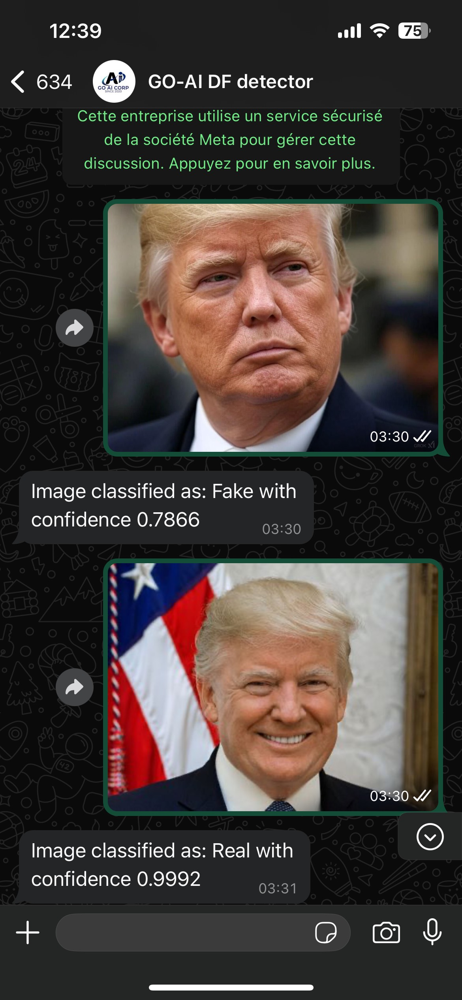
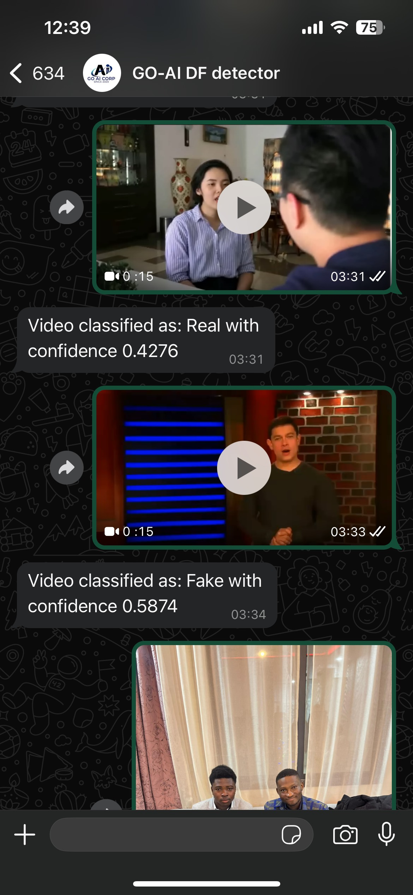
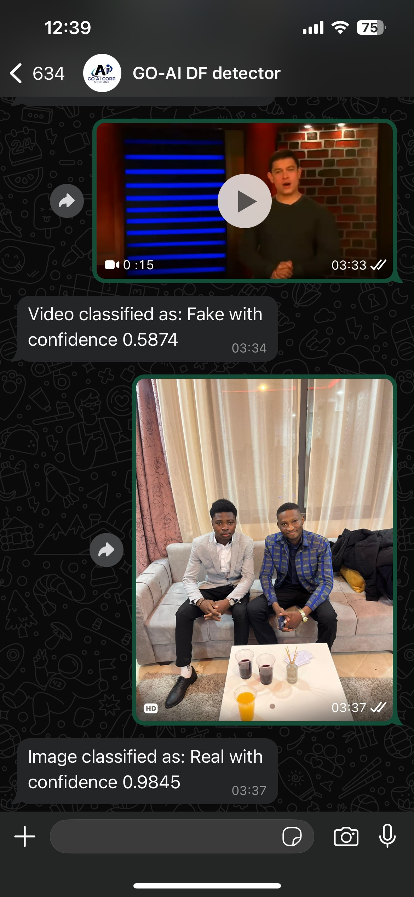
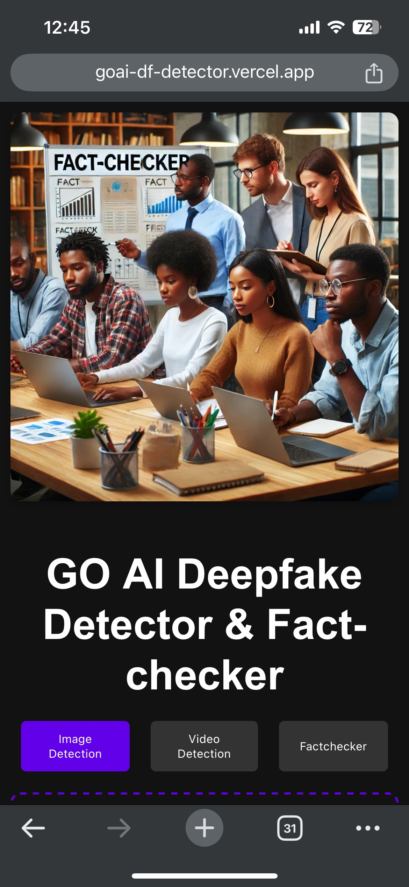
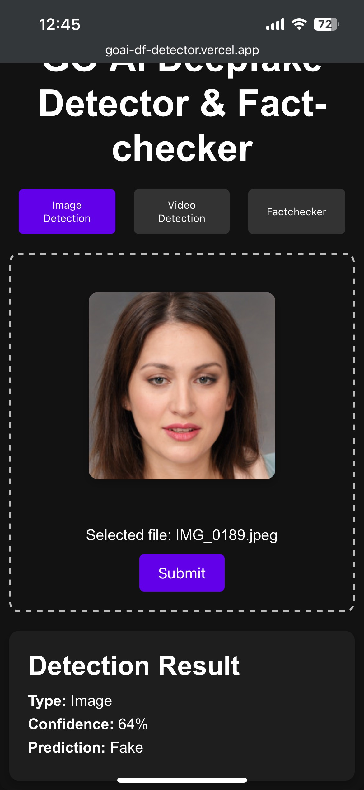
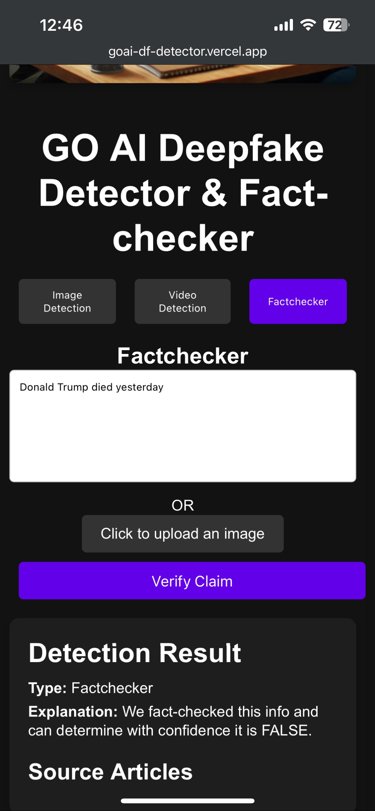

# Projet technical report

## AI-Powered Detection of Deepfakes and Misinformation: Delivering Truth and Trust back to the people

#### Report by Aristide Bandaogo and Alban Nyantudré from GO AI CORP' DATA SCIENCE & IoT DEPARTEMENT

## Context and  background

Recent advancements in artificial intelligence (AI) have transformed how societies interact with digital media. Technologies such as deep learning and natural language processing now enable the creation of highly realistic but entirely synthetic content, including deepfake images, videos, and text. This poses significant risks, particularly in the realm of misinformation and disinformation, where deepfakes are increasingly used to manipulate public opinion and erode trust in institutions.

In Burkina Faso particularly, a nation facing a complex socio-political situation marked by terrorism, disinformation, and political instability, the impact of misinformation is especially pronounced. Extremist groups and other oppenent political actors leverage digital platforms to spread fake news and deepfake media, aiming to incite violence, sow confusion and spread fear. Addressing these threats requires innovative AI-based solutions that can detect and counteract manipulated media and verify the authenticity of claims in real-time.

This project focuses on the development of an AI-powered system capable of detecting deepfake images and videos, as well as verifying the accuracy of textual claims. By leveraging advanced machine learning models, our system aims to strengthen the resilience of Burkina Faso’s media ecosystem and prevent the spread of harmful narratives.
## System overview
### Deepfake Image Detector
Our approach here included Fine-tuning Existing Pre-trained Models  including VGG-16, ResNet50, Inceptionv3, and EfficientNet and Vision Transformer, on deepfake detection tasks. The fine-tuning process involved adjusting the models to specialize in deepfake characteristics, utilizing transfer learning to capitalize on their pre-trained capabilities. After several tests, we deployed the finetuned version of ResNet50 which so far showed the best performances and accuracy being able to detect the images generated by the latest state of art models including Grok, Qween and Midjourney.

### Deepfake video Detector
Our deepfake video detection approach involved fine-tuning the UCF model from DeepfakeBench(Link to paper:https://arxiv.org/abs/2307.01426), a robust pre-trained model specifically designed for deepfake detection tasks. The UCF model is recognized for its ability to handle a wide range of deepfake generation techniques, making it highly adaptable to emerging threats. By leveraging transfer learning, we optimized the UCF model to detect subtle inconsistencies in facial expressions, lighting, and movements across video frames. This enhanced model serves as a critical tool in countering video-based disinformation campaigns, especially those propagated by extremist groups seeking to destabilize communities.

### Factchecker for Verifying Claims
The factchecker module operates as a Retrieval-Augmented Generation (RAG) system, leveraging a vector store for similarity search and the GPT language model for generating responses. It extracts text from images using Optical Character Recognition (OCR) and then searches a pre-built vector store containing embeddings of verified claims and trusted sources. If no relevant similarity is found in the vector store, the system performs an online search using the Serper API to gather recent articles from trusted news sources. Relevant documents from either source are passed to a GPT-based summarization model to verify the accuracy of the extracted claims. This RAG approach enhances the fact-checking process by ensuring that responses are grounded in reliable information. Users can interact with this module via WhatsApp, making it accessible to journalists, security agencies, and citizens. The integration of retrieval, online search, and generation capabilities allows the factchecker to provide accurate and contextually relevant verification in real-time, addressing the challenges posed by misinformation and disinformation in Burkina Faso.
In case the AI cannot verify the claim then it will be sent to manual Factcheckers FasoCheck for manual verification.

### Technology stack
Programming Language: Python - Typescript
Frameworks: FastAPI, EasyOCR, Hugging Face ....
Libraries: PyTorch, OpenCV, Transformers ....
Cloud Platform: Google Cloud Run & Vertex AI
Twilio API for WhatsApp Integration

### Datasets
#### Real People: CelebA, VGGFace2, and IMDB-WIKI 
#### Deep Fakes: Celeb-DF and FaceForensics++

### Use Cases and Impact

#### Countering Terrorist Propaganda

Terrorist organizations often release manipulated media to spread fear and recruit individuals. The deepfake detection tools can identify and flag such content, preventing its spread and mitigating its impact on vulnerable populations.

#### Fact-Checking Political Statements

In the context of elections, misinformation can destabilize democratic processes. The factchecker module can verify claims made by political actors, ensuring that voters have access to accurate information.

#### Combating Social Media Misinformation

Fake news on social media can escalate tensions and incite violence. By providing real-time verification tools, the system can help media organizations and fact-checkers quickly debunk false narratives, promoting peace and stability.

### Challenges
Some of the challenges we have include:
##### - Limited infrastructure especially when there are too many requests
##### - Keeping detection models updated to recognize these evolving threats requires ongoing research, retraining, and fine-tuning as deepfake generators evolve quickly
##### - Computational resources required for real-time detection and verification.

### Future Enhancements

#### - Continuous Model Updates
#### - Expanding Language Support to Moore and Dioula via the TTS models already available
#### - Real-Time Alerts and Reporting in case of spotted deepfake over social media
#### - Browser extension integration
#### - Offline availaibility via mobile app for People with no internet access
#### -Integration with Social Media Platforms

### Few Demo images
#### To test the deepfake detector via WhatsApp please register the following number : + 212 660 862 067 and have fun. You can send any image or media.
#### To test the factchecker via WhatsApp you need to join the sandbox via this link https://api.whatsapp.com/send/?phone=%2B14155238886&text=join+careful-herself&type=phone_number&app_absent=0.   Send the careful-herself message to join the sandbox and from there you can send any claim or image for factchecking
### Same features available on the webapp https://goai-df-detector.vercel.app/

